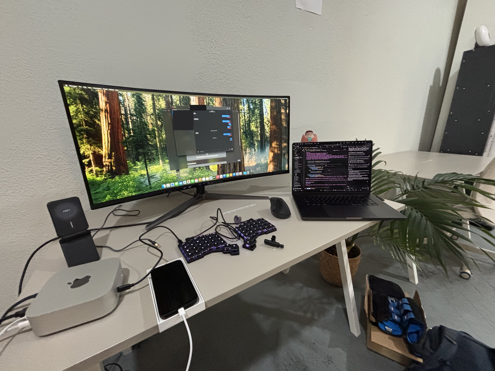
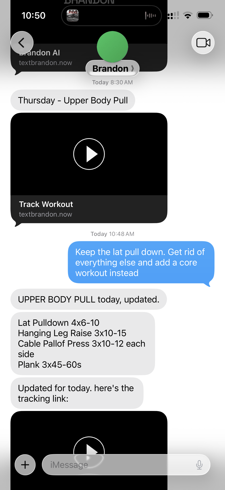
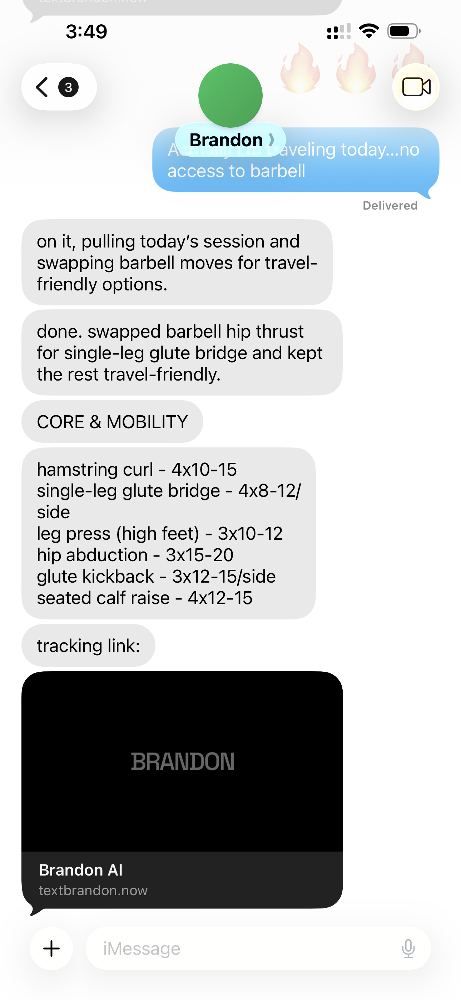
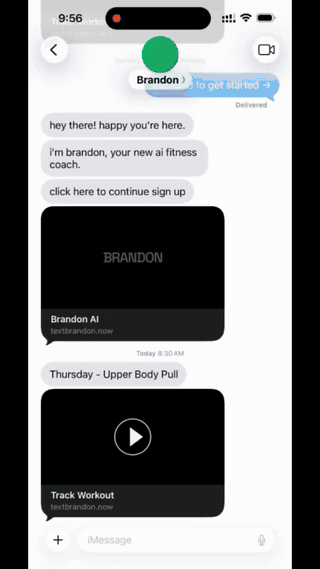

# Brandon — an AI fitness coach that lives in your texts

**Personalized workouts, texted daily. No app needed.**

Brandon is a subscription AI fitness coach that users interact with entirely over iMessage. You sign up on the web, describe your goals and equipment, and get a personalized training plan. Then Brandon texts you every day: your workout, a tracking link, and a coach you can talk to like a real person ("traveling today, no barbell" → your session gets rewritten on the spot).

This repo is a case study of the full system: three services I designed, built, and ran in production.


## Why iMessage?

Fitness apps have a retention problem: downloading an app, creating an account, and remembering to open it is friction that kills habits. Everyone already opens their texts. Building the coach *inside* iMessage meant zero-install onboarding and a channel with near-100% open rates.

Green bubbles would just not do. Blue feels like texting a real human; green feels like a verification code or a marketing scam. That trust exists precisely *because* Apple keeps iMessage closed to commercial senders. So the only way in was to text the way a human does: programmatically, but from a verified iCloud account with a real phone number.

The catch: **there is no iMessage API.** Apple doesn't offer one. Solving that constraint shaped the entire architecture.

## Architecture

```
                        ┌──────────────────────────────────────────────┐
                        │                                              │
 ┌──────────┐  iMessage │ ┌────────────────┐   HTTPS   ┌─────────────┐ │
 │   User   │◄─────────►│ │    Mac mini    │◄─────────►│   FastAPI   │ │
 │ (iPhone) │           │ │  relay server  │           │   backend   │ │
 └────┬─────┘           │ │(imessage-relay)│           │  (backend/) │ │
      │                 │ └────────────────┘           └──────┬──────┘ │
      │ web             │                                     │        │
      │ onboarding      │                              ┌──────┴──────┐ │
      ▼                 │ ┌────────────────┐           │   OpenAI    │ │
 ┌──────────┐   HTTPS   │ │    Supabase    │◄──────────┤  Supabase   │ │
 │ Web app  │◄─────────►│ │   (Postgres)   │           │   Stripe    │ │
 │(browser) │           │ └────────────────┘           └─────────────┘ │
 └──────────┘           │            web/ (Express + React)            │
                        └──────────────────────────────────────────────┘
```

| Directory | Service | Stack |
|---|---|---|
| [`imessage-relay/`](imessage-relay/) | iMessage relay on a Mac mini, the piece that makes the whole product possible | Node.js, SQLite, AppleScript |
| [`backend/`](backend/) | Coaching brain: AI agent, conversation history, daily message scheduler, subscription gating | Python, FastAPI, OpenAI, Supabase |
| [`web/`](web/) | Web app: marketing site, onboarding, Stripe payments, workout tracker | React, TypeScript, Express, Drizzle, Tailwind |

## The interesting part: texting without an API

Since Apple provides no programmatic access to iMessage, the relay runs on a physical Mac mini on my desk:



- **Reading:** the relay polls the Mac's Messages database (`chat.db`) directly with SQLite, deduplicating against a persisted ledger of processed message IDs so restarts never double-process a text.
- **Sending:** replies go out through AppleScript automation of the Messages app, including driving the actual input field to show real **typing indicators** before each message lands. Because that automation controls the one real Messages UI, only one conversation can "type" at a time; a typing queue hands the indicator from conversation to conversation.
- **Multi-chunk replies:** the AI's response arrives as separate bubbles sent with natural per-chunk delays, so a workout plan reads the way a human coach would text it, not as one wall of text.

The relay is a deliberately "dumb pipe": all intelligence lives in the backend, so the Mac-side code stays small and nearly never needs to change.

## The coaching brain

The FastAPI backend receives batched messages from the relay and orchestrates the response:

1. Look up the user by phone number and **validate their Stripe subscription**; coaching is gated in real time.
2. Assemble context: profile (goals, equipment, split), current workout plan, and recent conversation history.
3. Run the coaching agent (OpenAI) with version-controlled prompt templates: prompts live in the database with version history, editable from an admin panel without a deploy.
4. Persist both sides of the conversation and return chunked replies to the relay.

People text in bursts, so each user gets a **serialized message queue**: if new texts arrive while a response is still being generated, they're queued and folded into a rerun instead of spawning overlapping replies; the coach answers the full thought, once.

A cron-driven scheduler also generates each user's **daily workout text** at their preferred time, the core retention loop of the product.

<p>
  
  
</p>

## LLM UX: making an AI text like a person

The model is the easy part. The hard part of an agent that lives in iMessage is that everyone has two decades of intuition about how texting works, and anything that violates it (walls of text, instant replies to half-finished thoughts, chatbot voice) reads as a phone tree instead of a coach. The emerging iMessage-agent ecosystem calls this discipline **agent UX**. Brandon's version of it, all implemented in this repo:

- **Bubbles, not walls.** The agent is prompted to break replies with `---` delimiters; the backend splits on them ([`backend/app/sms/handler.py`](backend/app/sms/handler.py)) and the relay sends each piece as its own bubble with a natural pause between chunks. A workout plan lands as a scannable list in its own bubble, the way a human coach would text it.
- **Real typing indicators.** Not simulated: the relay drives the actual Messages input field, so the recipient sees the genuine iMessage typing bubble while the response is being generated.
- **One thought, one reply.** People text in bursts. Messages that arrive mid-generation are folded into a rerun through the per-user queue, so Brandon answers the complete thought once instead of replying to each fragment.
- **The right to stay silent.** The response schema is `reply_type: "message" | "no_reply"`. A real person doesn't reply to "ok thanks", so neither does Brandon.
- **A contact, not a chatbot.** Onboarding delivers a vCard, so Brandon sits in your contacts with a name and photo, texting from a real number over iMessage rather than a five-digit shortcode.
- **A texting register.** The system prompt enforces the medium: replies capped at one to three sentences, casual language, sparing emoji, and an occasional follow-up question, because "this is SMS, not an essay."
- **Texts on your schedule.** The daily workout message goes out at each user's chosen time via the scheduler, arriving like a habit cue rather than a notification blast.

## The web app

The only time users touch a browser: onboarding (goals → equipment → schedule → plan preview), payment (Stripe), and an optional mobile workout tracker that Brandon links in his daily text, where you log sets and weights without ever installing anything.



Notable details:

- **Twilio Verification**
- **Google auth**
- **Apple Pay / Google Pay**
- **PostHog session replay**

## Running it

Each service has its own README with setup instructions:

- [imessage-relay/README.md](imessage-relay/README.md): requires a Mac with Messages signed in
- [backend/README.md](backend/README.md): FastAPI + Supabase + OpenAI
- [web/README.md](web/README.md): web app

All secrets are environment-driven; each project ships a `.env.example`.

---

*Built by [Zoey Lee](https://github.com/zoooey99). Brandon ran as a live subscription product; this monorepo is a portfolio snapshot of that production system, MIT-licensed. Take whatever's useful.*
